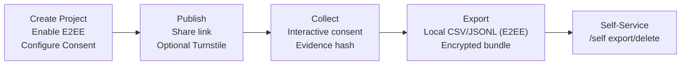

# Synap

**Synap** is a modern platform for psychological and behavioral research. It helps researchers design and run surveys, capture insights, and explore new ways of blending traditional methods with AI-driven analysis.

## Understand Synap in 30 seconds



- Promise highlights: end‑to‑end encryption (E2EE), local plaintext export for E2EE projects, self‑service participant rights, hashed consent evidence.
- Where to find in UI: Admin → Create Scale (E2EE + Consent), Admin → Manage, Survey → inline consent, Self page `/self` after submit.

## Features

* **Survey Builder** — customizable questionnaires (not limited to Likert scales)
* **Admin Console Refresh** — new Items / Settings / Share & Results tabs unify item editing, consent & Likert defaults, AI translation preview/apply, and context-aware exports; legacy view remains available if you need the previous workflow
* **Automated Metrics** — reliability checks such as Cronbach’s α
* **Consent & Compliance** — configurable interactive confirmations (Off/Optional/Required), optional signature; evidence hash; GDPR self‑service export/delete; consent text supports Markdown and inline markers (e.g., [[CONSENT]], [[CONSENT1]], [[CONSENT:options=…]])
* **Region-Aware Privacy** — PDPA by default; GDPR/CCPA/PIPL applied when stricter
* **End‑to‑End Encryption** — end‑to‑end encryption (enabled at creation); keys are generated in the browser and private keys never leave the device; admins can download encrypted bundles; local decryption exports JSONL/CSV (long/wide) with readable question texts; after submit a unified management link (/self) is shown for export/delete
* **Lightweight & Fast** — Go + TypeScript with encrypted snapshot storage (DB backends planned)
* **AI Integration (Planned)** — automated analysis, summarization, adaptive survey design

## Quick Start (UI in 3 steps)

1) Open `/auth` and register/sign in.
2) Admin → Create Scale: set Name, Points; toggle E2EE (recommended) and configure Consent (version + options/signature).
3) Open Admin → Manage (new default editor). Items handles question editing, Settings covers consent/Likert/AI translation, and Share & Results centralizes participant links, analytics, and exports. Copy the link from Share & Results to collect responses. With E2EE ON, use the local decrypt/export actions; otherwise server CSV exports remain available.

Advanced/Automation: see Quick Start (API) in `docs/quick-start.md`.

## At‑a‑Glance Comparison (key factors)

| Capability | Synap | Typical hosted survey | Open‑source form builder |
|---|---|---|---|
| End‑to‑End Encryption | Yes (client‑side keys) | Rare/No | Rare/No |
| Consent Evidence | Interactive + hashed receipt | Varies | Varies |
| GDPR Self‑Service | Unified `/self` export/delete | Varies | Varies |
| Bilingual (EN/ZH) | Built‑in i18n | Varies | Varies |
| Server plaintext exports | Optional (E2EE OFF). E2EE → local only | Often server CSV | Often server CSV |

## Why Synap

* Built for psychology students, researchers, and developers
* Scales from class assignments to full research projects
* Scientific rigor with developer-friendly workflows

## Tech Stack

* **Backend:** Go
* **Frontend:** TypeScript + React (Vite)
* **API Contract:** OpenAPI (auto-generated SDKs)

## Getting Started

### Requirements

* Go 1.23+
* Node.js 20+ and npm
* SQLite 3.x

### Clone

```bash
git clone https://github.com/soaringjerry/Synap.git
cd Synap
```

### Backend (Go)

```bash
# Example: run the API server (adjust path if your entrypoint differs)
go run ./cmd/server
```

Environment variables (examples):

```bash
export SYNAP_DB_PATH=./data/synap.db
export SYNAP_ENC_KEY=$(openssl rand -base64 32)
export SYNAP_ADDR=:8080
```

### Frontend (TypeScript)

```bash
cd frontend
npm install
npm run dev
```

Open [http://localhost:3000](http://localhost:3000)

Admin quick path:
- Create Scale → Basics + End‑to‑end Encryption (generate or upload a public key; locked after creation) + Consent (version, interactive confirmations, optional signature). Likert anchors are configured per item (add/edit) with presets (Agree 5/7, Frequency 5, Bipolar 7, Monopolar 5) or custom labels, and a “show numbers with labels” toggle.
- Manage → Items / Settings / Share & Results (new editor). Share & Results combines participant link copy, baseline analytics, and export options. When E2EE is ON you’ll see local JSONL/CSV decrypt buttons instead of server CSV; when E2EE is OFF the server long/wide/score CSV buttons return. Append `consent_header=label_en|label_zh` if you prefer consent columns to use readable labels.
- Consent Markdown supports inline markers: [[CONSENT]] inserts all (options + signature), [[CONSENT1]]/[[CONSENT2]] insert grouped options, [[CONSENT:signature]] inserts signature only. If no marker is present, the interactive block is shown after the text.

Security & Privacy snapshot:
- End‑to‑end encryption (E2EE) — content encrypted in browser; server stores only ciphertext.
- Encrypted at rest — snapshots use AES‑GCM.
- Consent evidence — hashed receipt for participants (printable PDF via browser print).
- Anti‑abuse — Cloudflare CDN + optional Turnstile; signals used only for security.

Participant self‑management:
- After submit, a unified management link `/self?...` is shown (non‑E2EE uses `pid+token`; E2EE uses `response_id+token`). Participants can revisit the link to export/delete the submission.

Participant UX:
- An E2EE notice is shown when end‑to‑end encryption is enabled (answers are encrypted in the browser and only visible to admins holding the keys — even the platform cannot read them).
- Consent receipt supports printing to PDF (a stable print view opens via a blob URL and is generated locally in the browser).

### Docker (GHCR)

Images (amd64):

- `ghcr.io/soaringjerry/synap-backend` — backend API only
- `ghcr.io/soaringjerry/synap` — fullstack (backend + built frontend static)
- `ghcr.io/soaringjerry/synap-dev` — dev image (backend + frontend dev server)

Run backend-only:

```bash
docker run -d --name synap -p 8080:8080 \
  -e SYNAP_ADDR=:8080 \
  ghcr.io/soaringjerry/synap-backend:latest
```

Run fullstack (serves Web + API on 8080):

```bash
docker run -d --name synap -p 8080:8080 \
  -e SYNAP_ADDR=:8080 \
  ghcr.io/soaringjerry/synap:latest
```

One‑click deploy (Scheme A: Docker + Compose + Caddy + Watchtower):

```bash
# Dev channel (auto‑update)
curl -fsSL https://raw.githubusercontent.com/soaringjerry/Synap/main/scripts/quick-deploy.sh \
  | sudo bash -s -- --channel dev --domain <your-domain> --email you@example.com --dir /opt/synap

# Stable channel (latest)
curl -fsSL https://raw.githubusercontent.com/soaringjerry/Synap/main/scripts/quick-deploy.sh \
  | sudo bash -s -- --channel latest --domain <your-domain> --email you@example.com --dir /opt/synap

Use behind your own Nginx (no Caddy, custom port):

```bash
curl -fsSL https://raw.githubusercontent.com/soaringjerry/Synap/main/scripts/quick-deploy.sh \
  | sudo bash -s -- --channel latest --edge none --port 9000 --dir /opt/synap
# Then in Nginx, proxy_pass http://127.0.0.1:9000;
```

More options in `docs/deploy.md`.

## Configuration

* `SYNAP_DB_PATH` — Encrypted snapshot file path (default `./data/synap.db`)
* `SYNAP_ENC_KEY` — 32‑byte encryption key (Base64 or raw; required for persistence)
* `SYNAP_ADDR` — server listen address (default `:8080`)
* `SYNAP_REGION_MODE` — privacy mode: `auto` (geo-aware) or `pdpa`/`gdpr`/`ccpa`/`pipl`
* `SYNAP_STATIC_DIR` — when set, backend serves static files from this directory (used by fullstack image)
* `SYNAP_TURNSTILE_SITEKEY` — Cloudflare Turnstile sitekey (public). When set, public scale metadata exposes it to render the widget.
* `SYNAP_TURNSTILE_SECRET` — Cloudflare Turnstile secret key (server verification). When a scale has Turnstile enabled (opt‑in per scale), submissions must include a valid token.

## Data & Privacy

- Primary storage is in Singapore. Transport is HTTPS/TLS; at‑rest encryption is required for persistence.
- We use Cloudflare CDN for performance and security. Requests may pass through edge nodes, but survey/response data resides only in our Singapore origin and is not retained at the edge. Cloudflare may temporarily process limited network metadata (e.g., IP) for routing/security; it is not used for advertising. See Privacy.
- Raw IPs are **not stored** in content data. Only minimal technical logs may be kept for security/quality control.
- Consent evidence is stored as a hashed record; participants receive a downloadable JSON copy.
- GDPR/PDPA alignment: we aim to follow core principles. Controllers remain responsible for lawful basis and data-subject rights.
- See: `/legal/privacy` (website) and `docs/legal/privacy.md`. Terms: `/legal/terms` and `docs/legal/terms.md`.

## Roadmap

* [ ] AI-assisted reliability/validity checks
* [ ] Cognitive/behavioral task support beyond surveys
* [ ] Visualization dashboards (responses, metrics)
* [ ] Team collaboration & roles
* [ ] Export pipelines (CSV, JSON, SPSS/R) and APIs

## Contributing

Contributions are welcome. Please use Conventional Commits (`feat:`, `fix:`, etc.) and ensure lint/tests pass before opening a PR. See `CONTRIBUTING.md` and `CODE_OF_CONDUCT.md`.

## License

This project is available for **personal and non-commercial use**.
For **commercial use**, please contact the author for a commercial license.

## Contact

Author: [Jerry](https://github.com/soaringjerry)
Email: *synap@forgotmail.com*

Additional docs: see `docs/ci-cd.md`, `docs/deploy.md`, `docs/i18n.md`, `docs/persistence.md`.
See also E2EE design and usage: `docs/e2ee.md`.
More docs:
- Installation: `docs/installation.md`
- Quick Start: `docs/quick-start.md`
- API: `docs/api/rest.md`
- Configuration: `docs/configuration.md`
- Architecture: `docs/architecture.md`
- Development: `docs/development.md`
- Testing: `docs/testing.md`
- Roadmap: `ROADMAP.md`
- FAQ: `docs/faq.md`
