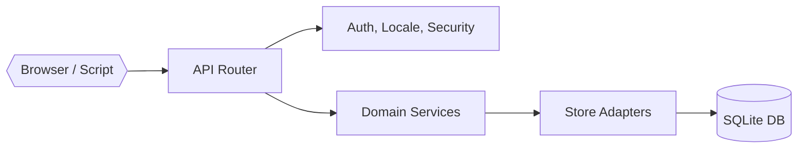

# Architecture Overview

Synap now follows a layered design that separates HTTP transport concerns from domain logic and persistence. The high-level components are:

- **Frontend** – Vite-powered React SPA. Feature folders (for example `frontend/src/pages/scale-editor/`) encapsulate state providers, view components, and supporting utilities.
- **API Gateway** – `internal/api/router.go` exposes REST endpoints, validates/normalises requests, and delegates domain work to services.
- **Service Layer** – `internal/services/` owns business logic. Each domain service exports Go interfaces and pure functions that can be unit-tested without HTTP dependencies.
- **Persistence** – `internal/db/` implements repositories on top of SQLite using `sqlc`-generated type-safe queries.

## Backend Layers

### API Router (`internal/api/router.go`)
- Registers all HTTP routes.
- Performs request decoding, basic validation, and error-to-HTTP mapping.
- Injects context (tenant, locale, auth) via middleware before calling services.

### Services (`internal/services/`)
- Encapsulate domain rules: authentication, scales, items, responses, exports, analytics, translation, consent, E2EE, etc.
- Each service depends on a narrow **store interface** that expresses only the persistence operations it needs (e.g., `ScaleStore`, `BulkResponseStore`).
- Services are pure Go and therefore unit-test friendly.

### Adapters (`internal/api/*_adapter.go`)
- Bridge the service store interfaces to concrete persistence implementations.
- Translate between API layer models and persistence structs when necessary.

### Persistence (`internal/db/`)
- SQLite is the primary datastore. SQL migrations live in `migrations/` and are applied on startup.
- `sqlc` generates strongly typed query wrappers inside `internal/db/sqlc/`.
- `sqlite_store.go` implements the store interfaces using the generated code and handles cross-cutting tasks such as audit logging.

### Middleware (`internal/middleware/`)
- Auth (JWT), locale detection, security headers, no-store cache directives, and CORS are composed around the router.

## Data Flow Example

1. Client sends `POST /api/auth/register`.
2. Router decodes JSON, calls `AuthService.Register`.
3. `AuthService` uses its store interface to create user + tenant records.
4. Store adapter persists via `SQLiteStore` (sqlc queries).
5. Service returns DTO; router serialises to JSON and attaches cookies as needed.

This pattern repeats for scales, items, responses, exports, analytics, etc., ensuring domain logic is reused across transports and tests.

## Frontend Architecture

- Feature folders organise complex pages. The Scale Editor uses `ScaleEditorContext` (a reducer-provided state store) with child views (`ItemsView`, `SettingsView`, `ShareView`).
- Shared UI spans (e.g., `DangerZone`, `ExportPanel`) consume context hooks instead of lifting state to individual components, improving testability and reuse.
- Vitest + React Testing Library cover reducers and components.

## Deployment Notes

- `cmd/server/main.go` boots the HTTP server, applies migrations, and configures static file serving / Vite proxying based on environment variables.
- The same binary powers local development and container builds.
- Optional legacy import: if `SYNAP_DB_PATH` and `SYNAP_ENC_KEY` are provided, the server migrates data into SQLite once, after which the SQLite file is authoritative.

For persistence specifics see `docs/persistence.md`; for development workflows see `docs/development.md`.
